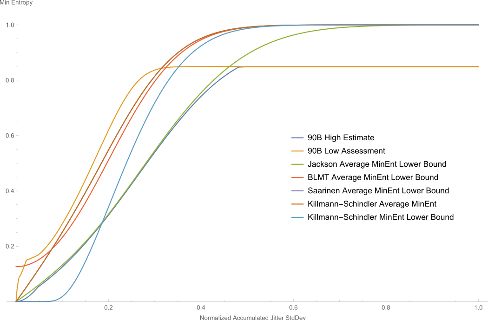
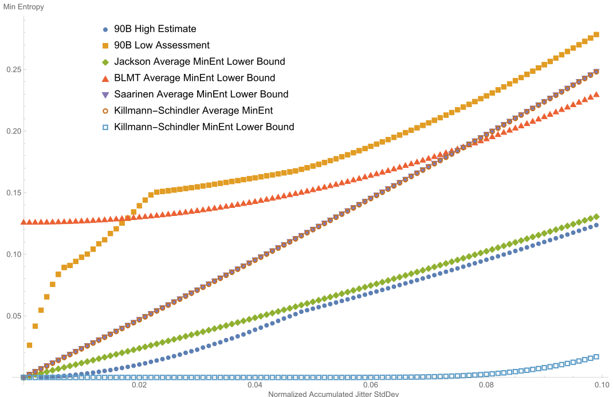

# Theseus
Theseus is an implementation of the [SP 800-90B](https://nvlpubs.nist.gov/nistpubs/SpecialPublications/NIST.SP.800-90B.pdf) tests. 

This project is named after Claude Shannon's [mechanical maze-solving mouse](https://www.technologyreview.com/2018/12/19/138508/mighty-mouse/).

For general SP 800-90B testing topics, please see [Joshua E. Hill's SP 800-90B web page](https://www.untruth.org/~josh/sp80090b/).

## Requirements

This was written with a fairly modern Linux system running on a somewhat modern Intel CPU (it uses BMI 2, SSE 4.2 and RdRand instructions). This is intended to be compiled using either a recent version of gcc (tested using gcc version 10.1.0, or clang (tested using clang version 11.1.0). This uses divsufsort, libbz2 and OpenMP, so these libraries (and their associated include files) must be installed and accessible to the compiler.

## Overview

* `src/` holds the codebase
* `ex/` holds data files used in examples

## How to run

The tools in this package operate on symbols of type `statData_t` (`uint8_t` by default) or on `uint32_t` unless otherwise specified.

One can make all the binaries using:

	make

### Executables that Implement Portions of SP 800-90B Testing
#### `non-iid-main`
Usage:
	`non-iid-main [-v] [-s] [-b <bitmask>] [-e <value>] [-l <index>,<samples> ] <inputfile>` <br />
	or<br />
	`non-iid-main [-v] [-s] [-b <bitmask>] [-e <value>] -R <k>,<L> -f`
* An implementation of the non-IID SP 800-90B estimators.
* `<inputfile>` is presumed to consist of `statData_t` integers in machine format
* `-v`: Verbose mode (can be used up to 10 times for increased verbosity).
* `-s`:  Send verbose mode output to stdout.
* `-i`: Calculate H\_bitstring and H\_I.
* `-c`: Conditioned output, only calculate H\_bitstring.
* `-r`: Raw evaluation, do not calculate H\_bitstring.
* `-l <index>,<samples>`: Read the `<index>` substring of length `<samples>`.
* `-b <bitmask>`: Only tests whose bits are set in `<bitmask>` are performed.
* `-g`: Use little endian conventions for creation of the bitstring used in calculation of H\_bitstring (extract data least-significant to most-significant bits).
* `-R <k>,<L>`: Randomly generate input data (`L` samples with `k` symbols) instead of reading a file.
* `-O <x>,<nu>`: Generate data from a simulated Ring Oscillator, with normalized jitter percentage of `<x>`% and normalized inter-sample expected phase change of `<nu>`. Negative `<nu>` forces random generation per-block.
* `-f`: Generate a random `<nu>` value only once, rather than on a per-evaluation-block basis.
* `-d`: Make all RNG operations deterministic.
* `-L <x>`: Perform evaluations on blocks of size `<x>`. Prevents a single assessment of the entire file (but this can be turned back on using the `-S` option).
* `-N <x>`: Perform `<x>` rounds of testing (only makes sense for randomly generated data).
* `-B <c>,<rounds>`: Perform bootstrapping for a `<c>`-confidence interval using `<rounds>`.
* `-P`: Establish an overall assessment based on a bootstrap of individual test parameters.
* `-F`: Establish an overall assessment based on a bootstrap of final assessments.
* `-S`: Establish an overall assessment using a large block assessment.

	The final assessment is the minimum of the overall assessments.


#### `restart-transpose`
Usage:
	`restart-transpose [-v] [-l <index> ] [-d <samples>,<restarts>] <inputfile>`
* Calculate the transpose of the provided restart data matrix.
* `<inputfile>` is assumed to be a sequence of `statData_t` integers
* output is sent to stdout
* `-v`: verbose mode
* `-l <index>`: Read the `<index>` substring of length `<samples * restarts>`. (default index = 0)
* `-d <samples>,<restarts>`: Perform the restart testing using the described matrix dimensions. (default is 1000x1000)

#### `restart-sanity`
Usage:
  `restart-sanity [-t <n>] [-v] [-n] [-l <index> ] [-d <samples>,<restarts>] [-c] [-i <rounds>] <H_I> <inputfile>` <br />
   or <br />
  `restart-sanity [-t <n>] [-v] [-n] [-k <m>]  [-d <samples>,<restarts>] [-c] [-i <rounds>] -r <H_I>`
* Perform the restart test for the provided restart data.
* `<inputfile>` is assumed to be a sequence of `statData_t` integers
* `<H_I>` is the assessed entropy.
*  output is sent to stdout
* `-v`: verbose mode
* `-l <index>`: Read the `<index>` substring of length `<samples * restarts>`.
* `-d <samples>,<restarts>`: Perform the restart testing using the described matrix dimensions. (default is 1000x1000).
* `-r`: Instead of doing testing on provided data use a random IID variable.
* `-k <m>`: Use an alphabet of `<m>` values (default `m`=2).
* `-n` Force counting a single fixed global symbol (Causes the test to be binomial).
* `-u`: Don't simulate the cutoff.
*  `-c <Xmaxcutoff>`: Use the provided cutoff.
* `-i <rounds>`: Use `<rounds>` simulation rounds (default is 2000000).
* `-t <n>`:  uses `<n>` computing threads (default: number of cores * 1.3).
* `-j <n>`: Each restart sanity vector is `<n>` elements long (default: min(1000,samples,restart))
* `-m <t>,<simsym>`: For simulation, Use `<t>` maximal size symbols (the residual probability is evenly distributed amongst the remaining `simsym-t` symbols).

#### `permtests`
Usage:
	`permtests [-v] [-t <n>] [-d] [-c] [-l <index>,<samples> ] <inputfile>` <br />
	or <br />
	`permtests [-v] [-b <p>] [-t <n>] [-k <m>] [-d] [-s <m>] [-c] -r`
* Perform the permutation IID tests on the provided data.
* `<inputfile>` is assumed to be a sequence of `statData_t` integers.
* `-r`: instead of doing testing on provided data use a random IID variable.
* `-d`: Make any RNG input deterministic (also force one thread).
* `-b <p>`: Set the bias to `<p>`, that is the least likely symbol has probability `k^(-p)`. Default is 1 (i.e., unbiased.)
* `-s <m>`: Use a sample set of `<m>` values (default `m`=1000000).
* `-k <k>`: Use an alphabet of `<k>` values (default `k`=2).
* `-v`: verbose mode. Repeating makes it more verbose.
* `-c`: Always complete all the tests.
* `-t <n>`: uses `<n>` computing threads (default: number of cores * 1.3).
* `-l <index>,<samples>`: Read the `<index>` substring of length `<samples>`.

#### `chisquare`
Usage:
	`chisquare [-v] [-l <index>,<samples> ] <inputfile>`
	or <br />
	`chisquare [-v] [-k <m>] [-s <m>] [-r]`
* Perform the chi square IID tests on the supplied data.
* `<inputfile>` is assumed to be a sequence of `statData_t` integers
* `-v`: verbose mode.
* `-l <index>,<samples>`: Read the `<index>` substring of length `<samples>`.
* `-r`:  Instead of doing testing on provided data use a random IID variable.
* `-k <k>`:  Use an alphabet of `<k>` values (default `k`=2).
* `-s <m>`:  Use a sample set of `<m>` values (default `m`=1000000).

#### `lrs-test`
Usage:
	`lrs-test [-v] [-l <index>,<samples> ] <inputfile>` <br />
	or <br />
	`lrs-test -r [-k <m>] [-s <m>]`
* Perform the LRS IID test on the supplied data.
* `<inputfile>` is assumed to be a sequence of `statData_t`
* `-v`: Verbose mode.
* `-l <index>,<samples>`: Read the `<index>` substring of length `<samples>`.
* `-r`: instead of doing testing on provided data use a random IID variable.
* `-k <k>`:  Use an alphabet of `<k>` values (default `k`=2).
* `-s <m>`:  Use a sample set of `<m>` values (default `m`=1000000).


### Interpretation and Processing Utilities
#### `selectbits`
Usage:
	`selectbits [-l logging dir] [-v] [-t <n>] [-c] <inputfile> <outputBits>`
* Identify the bit selections that are likely to contain the most entropy, up to `<outputBits>` bits wide.
* `<inputfile>` is assumed to be a stream of `uint32_t`
* `-t <n>`: uses `<n>` computing threads (default: number of cores * 1.3).
* `-l <dir>`:  uses `<dir>` to contain the log (default: current working directory)
* `-v`: verbose mode.
* `-c`: Conservative mode (use confidence intervals with the Markov estimator).

#### `highbin`
Usage:
	`highbin <inputfile> <outputBits>`
* Attempts to bin input symbols into `2^<outputBits>` bins with equal numbers of adjacent samples.
* `<inputfile>` is assumed to be a stream of `uint32_t` ints.
* output is to stdout, and is `statData_t` ints.

#### `translate-data`
Usage:
	`translate-data [-v] <inputfile>`
* Perform an order-preserving map to arrange the input symbols to (0, ..., k-1)
* `<inputfile>` is presumed to consist of `statData_t` in machine format
* output is sent to stdout, and is `statData_t` in machine format
* `-v`: Verbose mode (can be used up to 3 times for increased verbosity).
* `-n`: No data output. Report number of symbols on stdout.

#### `u32-translate-data`
Usage:
	`u32-translate-data [-v] <inputfile>`
* Perform an order-preserving map to arrange the input symbols to (0, ..., k-1)
* `<inputfile>` is presumed to consist of `uint32_t` in machine format
* output is sent to stdout, and is `uint32_t` in machine format
* `-v`: Verbose mode (can be used up to 3 times for increased verbosity).
* `-n`: No data output. Report number of symbols on stdout.

#### `Markov`
Usage:
	`markov [-v] [-c] <inputfile>`
* Run some variant of the SP 800-90B 2016 Markov test.
* `<inputfile>` is presumed to be a stream of `statData_t` ints.
* `-v`: Verbose mode (can be used several times for increased verbosity).
* `-p <cutoff>`: The lowest acceptable probability for a symbol to be relevant.
* `-c`: Disable the creation of confidence intervals.


### Other Data Utilities

#### `bits-in-use`
Usage:
	`bits-in-use <filename>`
* Determines the number of bits required to represent the given data after removing stuck and superfluous bits.
* Input values of type uint32_t are provided in `<filename>`.
* Output of text summary is sent to stdout.
* Example ODU01 - A binary file is given as input with command `./bits-in-use odu01-input-u32.bin`: 
    * Input (viewed with command `xxd odu01-input-u32.bin`):
	  ```
      00000000: 4142 4344 4546 4748 3031 3233 3435 3637  ABCDEFGH01234567
      00000010: 6162 6364 6566 6768                      abcdefgh
	  ```
    * Output (to console):
	  ```
      Read in 6 uint32_ts
      Non-fixed bits: 0x7F757775.
      Discarding bits equivalent to bit 30: 0x13515351.
      Discarding bits equivalent to bit 29: 0x00202020.
      Discarding bits equivalent to bit 18: 0x00000404.
      Bits to analyze: 0x6C040000.
      Found bitmask 0x6c040000
      5
	  ```

#### `discard-fixed-bits`
Usage:
	`discard-fixed-bits <filename>`
* Takes provided binary data and returns it with fixed bits discarded. Non-fixed bits are moved to the LSB of the output.
* Input values of type statData_t (default uint8_t) are provided in `<filename>`.
* Output values of type statData_t (default uint8_t) are sent to stdout.
* Example ODU02 - A binary file is given as input and stdout is sent to a binary file with command `./discard-fixed-bits odu02-input-sd.bin > odu02-output-sd.bin`: 
    * Input (viewed with command `xxd odu02-input-sd.bin`):
	  ```
      00000000: 4142 4344 4546 4748 3031 3233 3435 3637  ABCDEFGH01234567
      00000010: 6162 6364 6566 6768                      abcdefgh
      ```
    * Output (viewed with command `xxd odu02-output-sd.bin`): 
	  ```
      00000000: 2122 2324 2526 2728 1011 1213 1415 1617  !"#$%&'(........
      00000010: 3132 3334 3536 3738                      12345678
	  ```
    * Additional Output (to console): 
	  ```
      Read in 24 uint8_ts
      Non-fixed bits: 0x0000007F.
      Discarding bits equivalent to bit 6: 0x00000010.
      Bits to analyze: 0x0000006F.
      Symbols in the range [48, 104], 7 bit, bitmask: 0x0000006F
      Outputting data
	  ```

#### `double-merge`
Usage:
	`double-merge <file1> <file2> <outfile>`
* Merges two sorted lists of doubles into a single merged sorted list of doubles.
* Input values in binary double format are provided in `<file1>` and `<file2>`.
* Output values in binary double format are sent to `<outfile>`.
* Example ODU03 - Two pre-sorted binary files are given as input and a new file is identified for output with command `./double-merge odu03-input1-double.bin odu03-input2-double.bin odu03-output-double.bin`: 
    * Input 1 (viewed with command `xxd odu03-input1-double.bin`):
	  ```
      00000000: 1b9d f353 1cc7 f13f a96b ed7d aaaa 0a40  ...S...?.k.}...@
      00000010: 6284 f068 e338 1640 f052 ea92 711c 1f40  b..h.8.@.R..q..@
	  ```
	* Input 2 (viewed with command `xxd odu03-input2-double.bin`):
	  ```
      00000000: 1b9d f353 1cc7 0140 1b9d f353 1cc7 1140  ...S...@...S...@
      00000010: a96b ed7d aaaa 1a40 1b9d f353 1cc7 2140  .k.}...@...S..!@
	  ```
    * Output (viewed with command `xxd odu03-output-double.bin`):
	  ```
	  00000000: 1b9d f353 1cc7 f13f 1b9d f353 1cc7 0140  ...S...?...S...@
      00000010: a96b ed7d aaaa 0a40 1b9d f353 1cc7 1140  .k.}...@...S...@
      00000020: 6284 f068 e338 1640 a96b ed7d aaaa 1a40  b..h.8.@.k.}...@
      00000030: f052 ea92 711c 1f40 1b9d f353 1cc7 2140  .R..q..@...S..!@
	  ```

#### `double-minmaxdelta`
Usage:
	`double-minmaxdelta [-v] [-0] [filename]`
* Takes a set of human-readable doubles and provides the mean.
* Input values in double format are provided via stdin (by default) or in `[filename]` (if provided), one per line.
* Output of text summary is sent to stdout.
* Options:
    * `-v`: Verbose mode (can be used up to 3 times for increased verbosity).  This includes min and max values.
    * `-0`: Read in doubles in machine-specific binary format.
* Example ODU04 - A text file is given as input with command `./double-minmaxdelta odu04-input.txt`: 
    * Input (in odu04-input.txt, viewed with a text editor):
	  ```
	  0.111111
      2.074924
      2.145488
      2.196152
      2.029292
      2.784276
      3.000001
	  ```
	* Alternate Input (if `-0` is used and above data is now binary, viewed with command `xxd odu04-input-0-double.bin`):
	  ```
	  00000000: b3d1 393f c571 bc3f ea7b 0dc1 7199 0040  ..9?.q.?.{..q..@
      00000010: ffae cf9c f529 0140 255c c823 b891 0140  .....).@%\.#...@
      00000020: 8446 b071 fd3b 0040 344d d87e 3246 0640  .F.q.;.@4M.~2F.@
      00000030: 06bd 3786 0000 0840                      ..7....@
	  ```
    * Output (to console):
	  ```
	  2.88889
	  ```
    * Alternate Output (if `-v` is used, to console):
	  ```	  
      Max: 3.0000010000000001
      Min: 0.111111
      2.88889
	  ```

#### `double-sort`
Usage:
	`double-sort <filename>`
* Takes doubles from the file and sorts them.
* Input values in binary double format are provided in `<filename>`.
* Output values in binary double format are sent to stdout.
* Example ODU05 - A binary file is given as input and stdout is sent to a binary file with command `./double-sort odu05-input-double.bin > odu05-output-double.bin`: 
    * Input (viewed with command `xxd odu05-input-double.bin`):
	  ```
	  00000000: 6284 f068 e338 1640 f052 ea92 711c 1f40  b..h.8.@.R..q..@
      00000010: a96b ed7d aaaa 0a40 1b9d f353 1cc7 f13f  .k.}...@...S...?
	  ```
    * Output (viewed with command `xxd odu05-output-double.bin`):
	  ```
	  00000000: 1b9d f353 1cc7 f13f a96b ed7d aaaa 0a40  ...S...?.k.}...@
      00000010: 6284 f068 e338 1640 f052 ea92 711c 1f40  b..h.8.@.R..q..@
	  ```

#### `downsample`
Usage:
	`downsample [-b <block size>] <rate> <data file>`
* Groups data by index into modular classes mod `<rate>` evenly into the block size.
* `<rate>`: Number of input samples per output samples
* `-b`: Samples per output block (default 1000000)
* The uint8\_t values are output via stdout.
* Example ODU06 - 

#### `extractbits`
Usage:
	`extractbits <filename> <bitmask>`
* Takes the given binary data and extracts bits with `<bitmask>`.
* Input values of type uint32_t are provided in `<filename>`.
* Output values of type statData_t (default uint8_t) are sent to stdout.
* Options:
    * `<bitmask>`: Required. Type uint32_t value identifying the bitmask.  Read as an integer.
* Example ODU07 - A binary file is given as input, `bitmask` is set to 10 (0x0A000000) , and stdout is sent to a binary file with command `./extractbits odu07-input-u32.bin 10 > odu07-output-sd.bin`: 
    * Input (viewed with command `xxd odu07-input-u32.bin`):
	  ```
      00000000: 0100 0000 0200 0000 0300 0000 0400 0000  ................
      00000010: 0500 0000 0600 0000 0700 0000 0800 0000  ................
      00000020: 0900 0000 0a00 0000                      ........
	  ```
    * Output (viewed with command `xxd odu07-output-sd.bin`):
	  ```
      00000000: 0001 0100 0001 0102 0203                 ..........
	  ```
    * Additional Output (to console):
	  ``` 
      Input bitmask 0xA (Hamming weight: 2)
      Read in 10 uint32_ts
      Outputting data
	  ```

#### `hweight`
Usage:
	`hweight <bitmask>`
* Calculates the Hamming weight of `<bitmask>`.  As an example, the bit string 11101000 has a Hamming weight of 4.
* Input value `<bitmask>` of type uint32_t is a required argument that is read as an integer.
* Output of text summary is sent to stdout.
* Example ODU08 - `<bitmask>` is set to 16711935 (0xFF00FF00) with command `./hweight 16711935`: 
    * Output (to console):
	  ```
      16
	  ```

#### `u128-bit-select`
Usage:
	`u128-bit-select <bit>`
* Selects and returns the value in the given bit position (0 is the LSB, 127 is the MSB, little endian is assumed).
* Input values of type uint128_t (read as 2 uint64_t values) are provided via stdin.
* Output values of type statData_t (default uint8_t) are sent to stdout.
* Options:
    * `<bit>`: Required. Integer value between 0 and 127 representing the bit position of interest.
* Example ODU09 - A binary file is sent to stdin, `<bit>` is set to 0, and stdout is sent to a binary file with command `./u128-bit-select 0 < odu09-input-u128.bin > odu09-output-0-sd.bin`: 
    * Input (viewed with command `xxd odu09-input-u128.bin`):
	  ```
      00000000: 0100 0000 0000 0000 0000 0000 0000 0000  ................
      00000010: 0200 0000 0000 0000 0000 0000 0000 0000  ................
      00000020: 0300 0000 0000 0000 0000 0000 0000 0000  ................
      00000030: 0400 0000 0000 0000 0000 0000 0000 0000  ................
      00000040: 0500 0000 0000 0000 0000 0000 0000 0000  ................
      00000050: 0600 0000 0000 0000 0000 0000 0000 0000  ................
      00000060: 0700 0000 0000 0000 0000 0000 0000 0000  ................
      00000070: 0800 0000 0000 0000 0000 0000 0000 0000  ................
      00000080: 0900 0000 0000 0000 0000 0000 0000 0000  ................
      00000090: 0a00 0000 0000 0000 0000 0000 0000 0000  ................
	  ```
    * Output (viewed with command `xxd odu09-output-0-sd.bin`):
	  ```
      00000000: 0100 0100 0100 0100 0100                 ..........
      ```
	* Alternate Output (if `<bit>` = 1, viewed with command `xxd odu09-output-1-sd.bin`)
	  ```
      00000000: 0001 0100 0001 0100 0001                 ..........
	  ```
	* Alternate Output (if `<bit>` = 2, viewed with command `xxd odu09-output-2-sd.bin`)
	  ```
      00000000: 0000 0001 0101 0100 0000                 ..........
	  ```

#### `u128-discard-fixed-bits`
Usage:
	`u128-discard-fixed-bits <filename> <outputgroup>`
* Takes provided binary data and returns it with fixed bits discarded. Non-fixed bits are moved to the LSB of the output.
* Input values of type uint128_t (read as 4 uint32_t values) are provided in `<filename>`.
* Output values of type uint32_t located at `<outputgroup>` (an integer that specifies location in the file) are sent to stdout.
* Example ODU10 - A binary file is given as input, `<outputgroup>` is specified as 3, and stdout is sent to a binary file with command `./u128-discard-fixed-bits odu10-input-u128.bin 3 > odu10-output-3-u32.bin`: 
    * Input (viewed with command `xxd odu10-input-u128.bin`):
	  ```
      00000000: 4142 4344 4546 4748 3031 3233 3435 3637  ABCDEFGH01234567
      00000010: 6162 6364 6566 6768 4142 4344 4546 4748  abcdefghABCDEFGH
      00000020: 3031 3233 3435 3637 6162 6364 6566 6768  01234567abcdefgh
      ```
    * Output (viewed with command `xxd odu10-output-3-u32.bin`): 
	  ```
      00000000: 0100 0000 0200 0000 0300 0000            ............
	  ```
    * Alternate Output (if `<outputgroup>` = 1, viewed with command `xxd odu10-output-1-u32.bin`):
	  ```
      00000000: 0200 0000 0300 0000 0100 0000            ............
	  ```
    * Additional Output (to console): 
	  ```
      Read in 12 uint32_ts
      Symbols in the range [858927408, 1684234849] (31 bit: bitmask 0x60000000)
      Symbols in the range [926299444, 1751606885] (31 bit: bitmask 0x60000000)
      Symbols in the range [858927408, 1684234849] (31 bit: bitmask 0x60000000)
      Symbols in the range [926299444, 1751606885] (31 bit: bitmask 0x60000000)
      8 bits total
      Outputting group 3
	  ```

#### `u32-anddata`
Usage:
	`u32-anddata [filename] <bitmask>`
* Takes the given binary data and bitwise ANDs each symbol with `<bitmask>`.
* Input values of type uint32_t are provided via stdin (by default) or in `[filename]` (if provided).
* Output values of type uint32_t are sent to stdout.
* Options:
    * `<bitmask>`: Required. Type uint32_t value identifying the bitmask for performing AND operations.  Read as an integer.
* Example ODU11 - A binary file is given as input, `bitmask` is set to 16711935, and stdout is sent to a binary file with command `./u32-anddata odu11-input-u32.bin 16711935 > odu11-output-u32.bin`: 
    * Input (viewed with command `xxd odu11-input-u32.bin`):
	  ```
      00000000: 8040 2010 0804 0201 f00f ff00 ff00 ff00  .@ .............
	  ```
    * Output (viewed with command `xxd odu11-output-u32.bin`):
	  ```
      00000000: 8000 2000 0800 0200 f000 ff00 ff00 ff00  .. .............
	  ```
    * Additional Output (to console):
	  ``` 
      Andmask: 0x00ff00ff
      Outputting data
	  ```

#### `u32-bit-permute`
Usage:
	`u32-bit-permute [-r] <bit specification>`
* Permute bits within the given binary data as specified in `<bit specification>`.  Bit ordering is specified in the LSB 0 format (i.e., bit 0 is the LSB and bit 31 is the MSB).
* Input values of type uint32_t are provided via stdin.
* Output values of type uint32_t are sent to stdout.
* Options:
    * `-r`: Reverse the endianness of input values before permuting.
    * `<bit specification>`: Required. Ordered integer values between 0 and 31 representing the bit specification of interest.  Ordering of the bit specification is left to right, MSB to LSB, so the specification "31:30:29:28:27:26:25:24:23:22:21:20:19:18:17:16:15:14:13:12:11:10:9:8:7:6:5:4:3:2:1:0" is the identity permutation.  If fewer than 32 output bits are within the specification, the unspecified high order bits are set to 0.  Each bit position can be present at most once.
* Example ODU12 - A binary file is sent to stdin, `<bit specification>` is set to 31:30:29:28:27:26:25:24:23:22:21:20:19:18:17:16:15:14:13:12:11:10:9:8:7:6:5:4:3:2:1:0 (the identity permutation), and stdout is sent to a binary file with command `./u32-bit-permute 31:30:29:28:27:26:25:24:23:22:21:20:19:18:17:16:15:14:13:12:11:10:9:8:7:6:5:4:3:2:1:0 < odu12-input-u32.bin > odu12-output-identity-u32.bin`: 
    * Input (viewed with command `xxd odu12-input-u32.bin`):
	  ```
      00000000: 0100 0000 0200 0000 0300 0000 0400 0000  ................
      00000010: 0500 0000 0600 0000 0700 0000 0800 0000  ................
      00000020: 0900 0000 0a00 0000                      ........
	  ```
    * Output (viewed with command `xxd odu12-output-identity-u32.bin`):
	  ```
      00000000: 0100 0000 0200 0000 0300 0000 0400 0000  ................
      00000010: 0500 0000 0600 0000 0700 0000 0800 0000  ................
      00000020: 0900 0000 0a00 0000                      ........
      ```
	* Alternate Output (if `-r` is used, viewed with command `xxd odu12-output-identity-r-u32.bin`)
	  ```
      00000000: 0000 0001 0000 0002 0000 0003 0000 0004  ................
      00000010: 0000 0005 0000 0006 0000 0007 0000 0008  ................
      00000020: 0000 0009 0000 000a                      ........
	  ```
	* Alternate Output (if `<bit specification>` is set to 15:14:13:12:11:10:9:8:7:6:5:4:3:2:1:0:31:30:29:28:27:26:25:24:23:22:21:20:19:18:17:16, viewed with command `xxd odu12-output-swap-u32.bin`)
	  ```
      00000000: 0000 0100 0000 0200 0000 0300 0000 0400  ................
      00000010: 0000 0500 0000 0600 0000 0700 0000 0800  ................
      00000020: 0000 0900 0000 0a00                      ........

	  ```
	* Alternate Output (if `<bit specification>` is set to 15:13:11:9:7:5:3:1:31:29:27:25:23:21:19:17, viewed with command `xxd odu12-output-swapRemoveEven-u32.bin`)
	  ```
      00000000: 0000 0000 0001 0000 0001 0000 0000 0000  ................
      00000010: 0000 0000 0001 0000 0001 0000 0002 0000  ................
      00000020: 0002 0000 0003 0000                      ........
	  ```

#### `u32-bit-select`
Usage:
	`u32-bit-select [-r] <bit>`
* Selects and returns the value in the given bit position (0 is the LSB, 31 is the MSB).
* Input values of type uint32_t are provided via stdin.
* Output values of type statData_t (default uint8_t) are sent to stdout.
* Options:
    * `-r`: Reverse the endianness of input values before selecting the specified bit.
    * `<bit>`: Required. Integer value between 0 and 31 representing the bit position of interest.
* Example ODU13 - A binary file is sent to stdin, `<bit>` is set to 0, and stdout is sent to a binary file with command `./u32-bit-select 0 < odu13-input-u32.bin > odu13-output-0-sd.bin`: 
    * Input (viewed with command `xxd odu13-input-u32.bin`):
	  ```
      00000000: 0100 0000 0200 0000 0300 0000 0400 0000  ................
      00000010: 0500 0000 0600 0000 0700 0000 0800 0000  ................
      00000020: 0900 0000 0a00 0000                      ........
	  ```
    * Output (viewed with command `xxd odu13-output-0-sd.bin`):
	  ```
      00000000: 0100 0100 0100 0100 0100                 ..........
      ```
	* Alternate Output (if `<bit>` = 1, viewed with command `xxd odu13-output-1-sd.bin`)
	  ```
      00000000: 0001 0100 0001 0100 0001                 ..........
	  ```
	* Alternate Output (if `<bit>` = 2, viewed with command `xxd odu13-output-2-sd.bin`)
	  ```
      00000000: 0000 0001 0101 0100 0000                 ..........
	  ```

#### `u32-discard-fixed-bits`
Usage:
	`u32-discard-fixed-bits <filename>`
* Takes provided binary data and returns it with fixed bits discarded. Non-fixed bits are moved to the LSB of the output.
* Input values of type uint32_t are provided in `<filename>`.
* Output values of type uint32_t are sent to stdout.
* Example ODU14 - A binary file is given as input and stdout is sent to a binary file with command `./u32-discard-fixed-bits odu14-input-u32.bin > odu14-output-u32.bin`: 
    * Input (viewed with command `xxd odu14-input-u32.bin`):
	  ```
      00000000: 4142 4344 4546 4748 3031 3233 3435 3637  ABCDEFGH01234567
      00000010: 6162 6364 6566 6768                      abcdefgh
      ```
    * Output (viewed with command `xxd odu14-output-u32.bin`): 
	  ```
      00000000: 1200 0000 1500 0000 0800 0000 0b00 0000  ................
      00000010: 1a00 0000 1d00 0000                      ........
	  ```
    * Additional Output (to console): 
	  ```
      Read in 6 uint32_ts
      Symbols in the range [858927408, 1751606885], 31 bit, bitmask: 0x6C040000
      Outputting data
	  ```

#### `u32-gcd`
Usage:
	`u32-gcd <filename>`
* Finds common divisors and removes these factors from the given binary data.
* Input values of type uint32_t are provided in `<filename>`.
* Output values of type uint32_t are sent to stdout.
* Example ODU15 - A binary file is given as input and stdout is sent to a binary file with command `./u32-gcd odu15-input-u32.bin > odu15-output-u32.bin`: 
    * Input (viewed with command `xxd odu15-input-u32.bin`):
	  ```
      00000000: 8040 2010 0804 0201 f00f ff00 ff00 ff00  .@ .............
	  ```
    * Output (viewed with command `xxd odu15-output-u32.bin`):
	  ```
      00000000: 8037 1301 7833 1100 1001 1100 1100 1100  .7..x3..........
	  ```
    * Additional Output (to console):
	  ``` 
      Read in 4 uint32_ts
      Found common divisor 15
	  ```

#### `u32-manbin`
Usage:
	`u32-manbin inputfile cutoff_1 ... cutoff_{n-1}`
* convert data to one of the n bin numbers (0, ..., n-1).
* The cutoffs specify the first value in the next bin (so the first bin is `[0, cutoff_1)`, the second bin is `[cutoff_1, cutoff_2)`, the last bin is `[cutoff_{n-1}, UINT32_MAX ]` etc.)
* inputfile is assumed to be a stream of uint32\_ts
* output is to stdout, and is uint8\_t values
* Example ODU16 - 

#### `u32-regress-to-mean`
Usage:
	`u32-regress-to-mean <filename> <k>`
* Calculate the mean, and then force each `k`-block to have this mean, and then round the resulting values.
* Example ODU17 - 

#### `u32-selectdata`
Usage:
	`u32-selectdata <filename> <trimLowPercent> <trimHighPercent>`
* Attempt to keep the percentages noted in the provided binary data.
* Input values of type uint32_t are provided in `<filename>`.
* Output values of type uint32_t are sent to stdout.
* Options:
    * `<trimLowPercent>`: Required. Double value between 0 and 1.
    * `<trimHighPercent>`: Required. Double value between 0 and 1.
* Example ODU18 - A binary file is sent to stdin, trimLowPercent is set to 30%, tripHighPercent is set to 10%, and stdout is sent to a binary file with command `./u32-selectdata odu18-input-u32.bin .3 .1 > odu18-output-u32.bin`: 
    * Input (viewed with command `xxd odu18-input-u32.bin`):
	  ```
      00000000: 0100 0000 0200 0000 0300 0000 0400 0000  ................
      00000010: 0500 0000 0600 0000 0700 0000 0800 0000  ................
      00000020: 0900 0000 0a00 0000                      ........
	  ```
    * Output (viewed with command `xxd odu18-output-u32.bin`):
	  ```
      00000000: 0200 0000 0300 0000 0400 0000 0500 0000  ................
      00000010: 0600 0000 0700 0000 0800 0000            ............
	  ```
    * Additional Output (to console):
	  ``` 
      Read in 10 samples
      Copying data
      Sorting data
      Getting the 1 to the 7 entries
      MinValue = 2
      MaxValue = 8
      Outputting the data...
	  ```

#### `u32-selectrange`
Usage:
	`u32-selectrange <filename> <low> <high>`
* Extracts all values from the given binary data between a specified `low` and `high` (inclusive).
* Input values of type uint32_t are provided in `<filename>`.
* Output values of type uint32_t are sent to stdout.
* Options:
    * `<low>`: Required. Type uint32_t value identifying the lowest value in the range to select.
    * `<high>`: Required. Type uint32_t value identifying the highest value in the range to select.
* Example ODU19 - A binary file is sent to stdin, low is set to 16, high is set to 255, and stdout is sent to a binary file with command `./u32-selectrange odu19-input-u32.bin 16 255 > odu19-output-u32.bin`: 
    * Input (viewed with command `xxd odu19-input-u32.bin`):
	  ```
      00000000: 0100 0000 1000 0000 1100 0000 ff00 0000  ................
      00000010: 0001 0000 0011 0000 ff00 0000 0f00 0000  ................
	  ```
    * Output (viewed with command `xxd odu19-output-u32.bin`):
	  ```
      00000000: 1000 0000 1100 0000 ff00 0000 ff00 0000  ................
	  ```
    * Additional Output (to console):
	  ``` 
      Read in 8 samples
      Outputting data in the interval [16, 255]
      Outputting the data...
	  ```

#### `u32-xor-diff`
Usage:
	`u32-xor-diff`
* Produces the running XOR of adjacent values in provided binary data. 
* Input values of type uint32_t are provided via stdin.
* Output values of type uint32_t are sent to stdout.
* Example ODU20 - A binary file is sent to stdin and stdout is sent to a binary file with command `./u32-xor-diff < odu20-input-u32.bin > odu20-output-u32.bin`: 
    * Input (viewed with command `xxd odu20-input-u32.bin`):
	  ```
      00000000: 0100 0000 0001 0000 0000 0100 0000 0001  ................
	  ```
    * Output (viewed with command `xxd odu20-output-u32.bin`):
	  ```
      00000000: 0101 0000 0001 0100 0000 0101            ............
	  ```


### H_submitter Production Utilities
#### `ro-model`
Usage:
	`ro-model [-v] [-J] [-B] [-S] [-K] [-W] [-g gaussian-prop] <sigma>` <br />
* Produce a min entropy estimate using the selected stochastic model.
* Sigma is the observed normalized (period length) jitter standard deviation (expressed as a proportion of the ring oscillator period).
* `-v`: Verbose mode (can be used up to 3 times for increased verbosity).
* `-J`: Use the Jackson stochastic model.
* `-B`: Use the BLMT stochastic model.
* `-S`: Use the Saarinen stochastic model.
* `-K`: Use the Killmann-Schindler stochastic model.
* `-W`: Use the worst-case Killmann-Schindler stochastic model.
* `-g <r>`: Operate under the assumption that the unpredictable portion of the observed jitter is sigma*r (so reduce the observed jitter by the factor r).

Some example results are contained within the following graphs: <br />




Note that the Killmann-Schindler stochastic model and the Saarinen stochastic model produce effectively equivalent results.

#### `linear-interpolate`
Usage:
	`linear-interpolate [-v] [-i] [-x] <value>`
* Takes a set of points (`x_1`, `y_1`), ... (`x_n`, `y_n`), one point per line, from stdin and treats the points as a relation.
* The relation is then forced to be functional by discarding point; by default, the point with the lowest value (y-value) is retained for each distinct argument (x-value), unless otherwise directed.
* The points in the resulting function are then used to define and extension function f: `[x_1, x_n] -> R`, where the values are established through linear interpolation.
* The reference data may include the arguments (x-values) INFINITY (or INF) and -INFINITY (or -INF) as end arguments (`x_1` or `x_n`). These are a flag that the function should be extended as a constant function.
* The value of such points must be equal to the nearest argument (x-value).
* `-v`:      Verbose mode (can be used up to 3 times for increased verbosity).
* `-i`:      After the described relation is turned into a function, the relation's coordinates are exchanged, and points are discarded from the resulting relation until it is again a function (this is in some sense an inverse function).
*`-x`:      If we encounter a relation with multiple equal arguments, keep the one with the largest value (y-value).

This tool can be used to infer parameters from the statistical results.


### Test Data Production Utilities
#### `randomfile`
Usage:
	`randomfile [-v] [-b <p>,<bits>] [-s <m>] [-d] [-a <andmask>] [-n <mean>,<stddev>]`
* `-d`: Make any RNG input deterministic.
* `-b <p>,<b>`: Produce b-bit symbols with Pr(0) = p, of each other symbol is (1-p)/(2^b - 1).
* `-c <c>`: Produce 1-bit symbols with correlation c, that is Pr(X_j = a| X_{j-1} = a) = (c+1)/2 (so -1 <= c <= 1).
* `-n <mean>,<stddev>,<bits>`: Produce truncated normally distributed samples, with the provided mean and standard deviation, fitting into `<bits>` bits.
* `-u <startBias>,<serialCoefficient>,<stepNoiseMean>,<stepNoiseStdDev>,<leftStepSize>,<rightStepSize>`: Produce bitwise data using the SUMS model.
* `-p <magnitude>,<period>`: Sinusoidal bias, with `<magnitude>` and `<period>` listed (each sample takes 1 time unit).
* `-s <m>`: Use a sample set of `<m>` values. (default m=1000000)
* `-f <b>,<p>`: Output `<b>` bits from an output filtered via a LFSR (`<p>` is the LFSR)
* `-a <andmask>`: AND the output with andmask
* `-l <len>`: length of the averaging block.
* `-v`: verbose mode.
* `-t`: Output uint8_t integers.
* outputs random uint32_t (uint8_t when "-t" option is used) integers to stdout

#### `simulate-osc`
Usage:
	`simulate-osc [-v] [-n <samples>] [-p <phase>] [-f] [-u] <ringOscFreq> <ringOscJitterSD> <sampleFreq>`
*`<sampleFreq>` Is either the sampling frequency or "*" followed by the number of nominal ring oscillations per sample cycle.
* `-v`: Enable verbose mode.
* `-s`: Send verbose mode output to stdout.
* `-n <samples>`: Number of samples to generate (default: 1000000)
* `-p <phase>`:  Specify the initial phase of the ring oscillator from the interval [0,1) (relative to the sample clock). Default: generate randomly.
* `-d`: Make any RNG input deterministic.
* `-o`: Output deviation from deterministic output in addition to the actual output.
* `-f`: Fudge the ringOscFreq using a normal distribution.
* `-u`:  Fudge the average intra-sample phase change. (Fix the number of cycles per sample, and select the ISP fractional part uniformly from [0, 0.25]).
* Frequency values are in Hz.
* Jitter Standard Deviation is in seconds (e.g. 1E-15) or a percentage of the ring oscillator period (ending with %, e.g., 0.001%).
* Output is uint8\_t integers; lsb is oscillator output. next bit (if enabled) tracks deviations from the deterministic value.


### Result Interpretation Utilities
#### `percentile`
Usage:
	`percentile [-v] [-d] [-o] [-l] [-0] [-b <c>,<rounds>] [-u <low>,<high>] <p> [filename]`
* Takes a set of human-readable doubles and provides the pth percentile.  Percentile is estimated using the recommended NIST method [Hyndman and Fan's R6](http://www.itl.nist.gov/div898/handbook/prc/section2/prc262.htm).
* Input values in double format are provided via stdin (by default) or in `[filename]` (if provided), one per line.
* Output of text summary is sent to stdout.
* Options:
    * `-v`: Verbose mode (can be used up to 3 times for increased verbosity).
    * `-d`: Make any RNG deterministic.
    * `-o`: Produce only one output. If there is a confidence interval, report the minimum value.
    * `-l`: Treat the last value as an upper bound, rather than a data element. Report a single value, the min of the upper bound and the assessed value or smallest value in the confidence interval.
    * `-0`: Read in doubles in machine-specific binary format.
	* `-b <c>,<rounds>`:  Produce `<c>`-BCa bootstrap confidence intervals using `<rounds>` of bootstrapping.
    * `-u <low>,<high>`: Discard samples that are not in the range [low, high].
    * `<p>`: Required. Return the pth percentile where p is in the range [0, 1].
* Example RIU01 - A text file is given as input with a request for the 50% percentile with command `./percentile .50 riu01-input.txt`: 
    * Input (in riu01-input.txt, viewed with a text editor):
	  ```
	  0.111111
      2.074924
      2.145488
      2.196152
      2.029292
      2.784276
      3.000001
	  ```
	* Alternate Input (if `-0` is used and above data is now binary, viewed with command `xxd riu01-input-0-double.bin`):
	  ```
	  00000000: b3d1 393f c571 bc3f ea7b 0dc1 7199 0040  ..9?.q.?.{..q..@
      00000010: ffae cf9c f529 0140 255c c823 b891 0140  .....).@%\.#...@
      00000020: 8446 b071 fd3b 0040 344d d87e 3246 0640  .F.q.;.@4M.~2F.@
      00000030: 06bd 3786 0000 0840                      ..7....@
	  ```
    * Output (to console):
	  ```
      2.1454879999999998
	  ```
    * Alternate Output (if `-l` is used, to console):
	  ```	  
      2.1102059999999998
	  ```
    * Alternate Output (if `-b .95,10` is used, to console):
	  ```	  
      2.0749240000000002, 2.1454879999999998, 2.7842760000000002
	  ```
	* Alternate Output (if `-u 0.0,2.4999999999999999 ` is used, to console):
	  ```
	  2.0749240000000002
	  ```

#### `mean`
Usage:
	`mean [-v] [-d] [-o] [-0] [-b <c>,<rounds>] [-u <low>,<high>] [filename]`
* Takes a set of human-readable doubles and provides the mean.
* Input values in double format are provided via stdin (by default) or in `[filename]` (if provided), one per line.
* Output of text summary is sent to stdout.
* Options:
    * `-v`: Verbose mode (can be used up to 3 times for increased verbosity).
    * `-d`: Make any RNG deterministic.
    * `-o`: Produce only one output. If there is a confidence interval, report the minimum value.
    * `-0`: Read in doubles in machine-specific binary format.
	* `-b <c>,<rounds>`: Produce `<c>`-BCa bootstrap confidence intervals using `<rounds>` of bootstrapping.
    * `-u <low>,<high>`: Discard samples that are not in the range [low, high].
* Example RIU02 - A text file is given as input with command `./mean riu02-input.txt`: 
    * Input (in riu02-input.txt, viewed with a text editor):
	  ```
	  0.111111
      2.074924
      2.145488
      2.196152
      2.029292
      2.784276
      3.000001
	  ```
    * Output (to console):
	  ```
	  2.0487491428571429
	  ```
    * Alternate Output (if `-b .95,10` is used, to console):
	  ```	  
      1.8055411428571428, 2.0487491428571429, 2.4306298571428573
	  ```
	  * Alternate Output (if `-u 2.0,3.0` is used, to console):
	  ```	  
      2.2460264000000003
	  ```

#### `failrate`
Usage:
	`failrate [-v] [-s] [-0] <p> <q> [filename]`
* Takes a set of human-readable doubles and provides the proportion that are less than or equal to `<p>` or greater than or equal to `<q>`.  This is useful to characterize false positive rates for statistical tests with inclusive failure bounds.
* Input values in double format are provided via stdin (by default) or in `[filename]` (if provided), one per line.
* Output of text summary is sent to stdout.
* Options:
    * `-v`: Verbose mode (can be used up to 3 times for increased verbosity).
    * `-s`: Assume that the data is sorted.
    * `-0`: Read in doubles in machine-specific binary format.
    * `<p>`: Required. Lower bound as a double.
    * `<q>`: Required. Upper bound as a double.
* Example RIU03 - A text file is given as input, p is set to 0.1, and q is set to 3.0 with command `./failrate 0.1 3.0 riu03-input.txt`: 
    * Input (in riu03-input.txt, viewed with a text editor):
	  ```
	  0.111111
      2.074924
      2.145488
      2.196152
      2.029292
      2.784276
      3.000001
	  ```
    * Output (to console):
	  ```
	  Proportion in lower failure region: 0
      Proportion in upper failure region: 0.14285714285714285
      Proportion in failure region: 0.14285714285714285
	  ```


### Data Conversion Utilities
#### `u64-to-u32`
Usage:
	`u64-to-u32 [-r] [-t]`
* Converts provided binary data from type uint64_t to type uint32_t.
* Input values of type uint64_t are provided via stdin.
* Output values of type uint32_t are sent to stdout.
* Options:
    * `-r`: Switch endianness of input values.
    * `-t`: Truncate input values.
* Errors will occur if data remains out of range prior to uint32_t conversion.  I.e., the user must choose to truncate and/or switch endianness if necessary prior to type casting.
* Example DCU01 - A binary file is sent to stdin, truncation is selected, and stdout is sent to a binary file with command `./u64-to-u32 -t < dcu01-input-u64.bin > dcu01-output-u32.bin`: 
    * Input (viewed with command `xxd dcu01-input-u64.bin`):
	  ```
	  00000000: 4142 4344 4546 4748 3031 3233 3435 3637  ABCDEFGH01234567
      00000010: 6162 6364 6566 6768 3839 30              abcdefgh890
	  ```
    * Output (viewed with command `xxd dcu01-output-u32.bin`):
	  ```
	  00000000: 4142 4344 3031 3233 6162 6364            ABCD0123abcd
	  ```

#### `u64-counter-raw`
Usage:
	`u64-counter-raw <filename>`
* Extracts deltas treated as 64-bit unsigned counters (they may roll over).
* Input values of type uint64_t are provided in `<filename>`.
* Output values of type uint64_t are sent to stdout.
* Example DCU02 - A binary file is given as input and stdout is sent to a binary file with command `./u64-counter-raw dcu02-input-u64.bin > dcu02-output-u64.bin`: 
    * Input (viewed with command `xxd dcu02-input-u64.bin`):
	  ```
      00000000: 0100 0000 0000 0000 0400 0000 0000 0000  ................
      00000010: 1100 0000 0000 0000 2100 0000 0000 0000  ........!.......
      00000020: ffff ffff ffff ffff 0300 0000 0000 0000  ................
	  ```
    * Output (viewed with command `xxd dcu02-output-u64.bin`):
	  ```
      00000000: 0000 0000 0000 0000 0a00 0000 0000 0000  ................
      00000010: 0d00 0000 0000 0000 dbff ffff ffff ffff  ................
      00000020: 0100 0000 0000 0000                      ........
	  ```
	* Additional Output (to console):
	  ```
	  Read in 6 uint64_ts
      Shifting data down by 3. Maximum value now 18446744073709551579
	  ```

#### `u8-to-sd`
Usage:
	`u8-to-sd [-l] [-v] <bits per symbol; 1, 2, 4>`
* Converts provided binary data from type uint8_t to type statData_t.
* Input values of type uint8_t are provided via stdin.
* Output values of type statData_t (default uint8_t) are sent to stdout.
* Options:
    * `-l`: Bytes should be output low bits to high bits.
    * `-v`: Increase verbosity. Can be used multiple times.
	* `<bits per symbol>`: Number of bits per symbol, limited to values 1, 2, or 4.
* Example DCU03 - A binary file is sent to stdin, -l with 1 bit/symbol is selected, and stdout is sent to a binary file with command `./u8-to-sd -l 1 < dcu03-input-u8.bin > dcu03-output-1-sd.bin`: 
    * Input (viewed with command `xxd dcu03-input-u8.bin`):
	  ```
      00000000: 4142 3031 6162 3839                      AB01ab89
	  ```
    * Output (viewed with command `xxd dcu03-output-1-sd.bin`):
	  ```
      00000000: 0100 0000 0000 0100 0001 0000 0000 0100  ................
      00000010: 0000 0000 0101 0000 0100 0000 0101 0000  ................
      00000020: 0100 0000 0001 0100 0001 0000 0001 0100  ................
      00000030: 0000 0001 0101 0000 0100 0001 0101 0000  ................
	  ```
	* Alternate Output (if bits per symbol = 2, viewed with command `xxd dcu03-output-2-sd.bin`)
	  ```
      00000000: 0100 0001 0200 0001 0000 0300 0100 0300  ................
      00000010: 0100 0201 0200 0201 0002 0300 0102 0300  ................
	  ```
	* Alternate Output (if bits per symbol = 4, viewed with command `xxd dcu03-output-4-sd.bin`)
	  ```
      00000000: 0104 0204 0003 0103 0106 0206 0803 0903  ................
	  ```

#### `u16-to-u32`
Usage:
	`u16-to-u32 [-d]`
* Converts provided binary data from type uint16_t to type uint32_t.
* Input values of type uint16_t are provided via stdin.
* Output values of type uint32_t are sent to stdout.
* Options:
    * `-d`: Output differences between adjacent values.
* Example DCU04 - A binary file is given as input and stdout is sent to a binary file with command `./u16-to-u32 < dcu04-input-u16.bin > dcu04-output-u32.bin`: 
    * Input (viewed with command `xxd dcu04-input-u16.bin`):
	  ```
      00000000: 4142 3031 6162 3839 30                   AB01ab890
	  ```
    * Output (viewed with command `xxd dcu04-output-u32.bin`):
	  ```
	  00000000: 4142 0000 3031 0000 6162 0000 3839 0000  AB..01..ab..89..
	  ```
    * Alternate Output (if `-d` used, viewed with command `xxd dcu04-output-d-u32.bin`):
	  ```
	  00000000: efee 0000 3131 0000 d7d6 0000            ....11......
	  ```

#### `u64-to-ascii`
Usage:
	`u64-to-ascii`
* Converts provided binary data to human-readable decimal values.
* Input values of type uint64_t are provided via stdin.
* Output values in decimal format are sent to stdout, one per line.
* Example DCU05 - A binary file is sent to stdin with command `./u64-to-ascii < dcu05-input-u64.bin`: 
    * Input (viewed with command `xxd dcu05-input-u64.bin`):
	  ```
      00000000: 4142 4344 4546 4748 3031 3233 3435 3637  ABCDEFGH01234567
      00000010: 6162 6364 6566 6768 3839 30              abcdefgh890
	  ```
    * Output (to console): 
	  ```
      5208208757389214273
      3978425819141910832
      7523094288207667809
	  ```

#### `u32-to-sd`
Usage:
	`u32-to-sd <filename>`
* Converts provided binary data from type uint32_t to type statData_t.
* Input values of type uint32_t are provided in `<filename>`.
* Output values of type statData_t (default uint8_t) are sent to stdout.
* Example DCU06 - A binary file is given as input and stdout is sent to a binary file with command `./u32-to-sd dcu06-input-u32.bin > dcu06-output-sd.bin`: 
    * Input (viewed with command `xxd dcu06-input-u32.bin`):
	  ```
	  00000000: 4100 0000 4200 0000 3000 0000 3100 0000  A...B...0...1...
      00000010: 6100 0000 6200 0000 3800 0000 3900 0000  a...b...8...9...
      00000020: 3000                                     0.
      ```
    * Output (viewed with command `xxd dcu06-output-sd.bin`): 
	  ```
      00000000: 4142 3031 6162 3839                      AB01ab89
	  ```

#### `u16-to-sdbin`
Usage:
	`u16-to-sdbin [-l] [-b]`
* Converts provided binary data from type uint16_t to type statData_t by expanding packed bits.
* Input values of type uint16_t are provided via stdin.
* Output values of type statData_t (default uint8_t) are sent to stdout.
* Options:
    * `-l`: Extract bits from low bit to high bit.
	* `-b`: Input values are in big endian format.
* Example DCU07 - A binary file is sent to stdin and stdout is sent to a binary file with command `./u16-to-sdbin < dcu07-input-u16.bin > dcu07-output-sd.bin`: 
    * Input (viewed with command `xxd dcu07-input-u16.bin`):
	  ```
      00000000: 0101 1111 1010 00ff ff00 0000            ............
	  ```
    * Output (viewed with command `xxd dcu07-output-sd.bin`):
	  ```
      00000000: 0000 0000 0000 0001 0000 0000 0000 0001  ................
      00000010: 0000 0001 0000 0001 0000 0001 0000 0001  ................
      00000020: 0000 0001 0000 0000 0000 0001 0000 0000  ................
      00000030: 0101 0101 0101 0101 0000 0000 0000 0000  ................
      00000040: 0000 0000 0000 0000 0101 0101 0101 0101  ................
      00000050: 0000 0000 0000 0000 0000 0000 0000 0000  ................
	  ```
    * Alternate Output (if `-l` used, viewed with command `xxd dcu07-output-l-sd.bin`):
	  ```
      00000000: 0100 0000 0000 0000 0100 0000 0000 0000  ................
      00000010: 0100 0000 0100 0000 0100 0000 0100 0000  ................
      00000020: 0000 0000 0100 0000 0000 0000 0100 0000  ................
      00000030: 0000 0000 0000 0000 0101 0101 0101 0101  ................
      00000040: 0101 0101 0101 0101 0000 0000 0000 0000  ................
      00000050: 0000 0000 0000 0000 0000 0000 0000 0000  ................
	  ```
    * Alternate Output (if `-b` used, viewed with command `xxd dcu07-output-b-sd.bin`):
	  ```
      00000000: 0000 0000 0000 0001 0000 0000 0000 0001  ................
      00000010: 0000 0001 0000 0001 0000 0001 0000 0001  ................
      00000020: 0000 0001 0000 0000 0000 0001 0000 0000  ................
      00000030: 0000 0000 0000 0000 0101 0101 0101 0101  ................
      00000040: 0101 0101 0101 0101 0000 0000 0000 0000  ................
      00000050: 0000 0000 0000 0000 0000 0000 0000 0000  ................
	  ```

#### `u64-jent-to-delta`
Usage:
	`u64-jent-to-delta`
* Converts provided binary data from uint64_t deltas in jent format to uint64_t deltas in nanoseconds format.  Also guesses native byte order and swaps if necessary.  Jent format expects the upper 32 bits to contain seconds and the lower 32 bits to contain nanoseconds.
* Input values of type uint64_t (in default jent delta format) are provided via stdin.
* Output values of type uint64_t are sent to stdout.
* Example DCU08 - A binary file is sent to stdin and stdout is sent to a binary file with command `./u64-jent-to-delta < dcu08-input-u64.bin > dcu08-output-u64.bin`: 
    * Input (viewed with command `xxd dcu08-input-u64.bin`):
	  ```
      00000000: 0000 0000 0000 0000 00ca 9a3b 0000 0000  ...........;....
      00000010: 0000 0000 0100 0000 00ca 9a3b 0100 0000  ...........;....
      00000020: 0000 0000 0200 0000 0000 0000 0300 0000  ................
	  ```
    * Output (viewed with command `xxd dcu08-output-u64.bin`):
	  ```
      00000000: 0000 0000 0000 0000 00ca 9a3b 0000 0000  ...........;....
      00000010: 00ca 9a3b 0000 0000 0094 3577 0000 0000  ...;......5w....
      00000020: 0094 3577 0000 0000 005e d0b2 0000 0000  ..5w.....^......
	  ```
	* Additional Output (to console):
	  ```
      Native byte order seems better (0.5)
	  ```

#### `u32-to-categorical`
Usage:
	`u32-to-categorical [-v] [-m] [-t <value>] [-z] <filename>`
* Produces categorical summary of provided binary data.
* Input values of type uint32_t are provided in `<filename>`.   
* Output of text summary is sent to stdout.
* Options:
    * `-v`: Increase verbosity. Can be used multiple times.
    * `-m`: Output in Mathematica-friendly format.
    * `-t <value>`: Trim any value that is prior to the first symbol with `<value>` occurrences or more or after the last symbol with `<value>` occurrences or more.
    * `-z`: Don't output zero categories.
* Example DCU09 - A binary file is given as input with command `./u32-to-categorical dcu09-input-u32.bin`: 
    * Input (viewed with command `xxd dcu09-input-u32.bin`):
	  ```
      00000000: 0100 0000 0100 0000 0200 0000 0500 0000  ................
      00000010: 0500 0000 0500 0000 0500 0000 0100 0000  ................
	  ```
    * Output (to console):
	  ```
      1: 3
      2: 1
      3: 0
      4: 0
      5: 4
	  ```
    * Alternate Output (if `-m` used, to console):
	  ```
	  ./dcu09-input-u32.bin={{1, 3},{2, 1},{3, 0},{4, 0},{5, 4}};
	  ```
    * Alternate Output (if `-t 4` used, to console):
	  ```
      5: 4
	  ```
	* Alternate Output (if `-z` used, to console):
	  ```
      1: 3
      2: 1
      5: 4
	  ```

#### `dec-to-u32`
Usage:
	`dec-to-u32`
* Converts provided human-readable decimal values to binary data.  (Note this is the opposite of u32-to-ascii.)
* Input values in decimal format are provided via stdin, one per line.
* Output values of type uint32_t are sent to stdout.
* Example DCU10 - A text file is sent to stdin and stdout is sent to a binary file with command `./dec-to-u32 < dcu10-input.txt > dcu10-output-u32.bin`: 
    * Input (in dcu10-input.txt, viewed in a text editor):
	  ```
	  1145258561
      1212630597
      858927408 
      926299444
      1684234849
      1751606885
	  ```
    * Output (viewed with command `xxd dcu10-output-u32.bin`): 
	  ```
	  00000000: 4142 4344 4546 4748 3031 3233 3435 3637  ABCDEFGH01234567
      00000010: 6162 6364 6566 6768                      abcdefgh
	  ```

#### `u32-expand-bitwidth`
Usage:
	`u32-expand-bitwidth <filename>`
* Extracts inferred values under the assumption that the data is a truncation of some sampled value, whose bitwidth is inferred.
* Input values of type uint32_t are provided in `<filename>`.
* Output values of type uint64_t are sent to stdout.
* Example DCU11 - A binary file is given as input and stdout is sent to a binary file with command `./u32-expand-bitwidth dcu11-input-u32.bin > dcu11-output-u64.bin`: 
    * Input (viewed with command `xxd dcu11-input-u32.bin`):
	  ```
      00000000: 0000 010d 0000 0000 0000 010b 0000 0142  ...............B
      00000010: 0000 011f 0000 011f 0000 0152            ...........R
	  ```
    * Output (viewed with command `xxd dcu11-output-u64.bin`):
	  ```
	  00000000: 0000 010d 0000 0000 0000 0000 0000 0000  ................
      00000010: 0000 010b 0000 0000 0000 0142 0000 0000  ...........B....
      00000020: 0000 011f 0000 0000 0000 011f 0000 0000  ................
      00000030: 0000 0152 0000 0000                      ...R....
	  ```
	* Additional Output (to console):
	  ``` 
	  Read in 7 uint32_ts
      Next binary power: 2147483648 (assuming a 31 bit value)
      Found most obvious transition at index: 3 (0x0B010000 -> 0x42010000)
      Now 000b010000 -> 0x0042010000
      New max 1375797248 (index 6)
      New min 0
	  ```

#### `u32-to-ascii`
Usage:
	`u32-to-ascii`
* Converts provided binary data to human-readable decimal values.  (Note this is the opposite of dec-to-u32.)
* Input values of type uint32_t are provided via stdin.
* Output values are sent to stdout, one per line.
* Example DCU12 - A binary file is sent to stdin with command `./u32-to-ascii < dcu12-input-u32.bin`: 
    * Input (viewed with command `xxd dcu12-input-u32.bin`):
	  ```
      00000000: 4142 4344 4546 4748 3031 3233 3435 3637  ABCDEFGH01234567
      00000010: 6162 6364 6566 6768 3839 30              abcdefgh890
	  ```
    * Output (to console): 
	  ```
      1145258561
      1212630597
      858927408 
      926299444 
      1684234849
      1751606885
	  ```

#### `sd-to-hex`
Usage:
	`sd-to-hex`
* Converts provided binary data to human-readable hexidecimal values.
* Input values of type statData_t (default uint8_t) are provided via stdin.
* Output values in hexidecimal format are sent to stdout, one per line.
* Example DCU13 - A binary file is sent to stdin with command `./sd-to-hex < dcu13-input-u8.bin`: 
    * Input (viewed with command `xxd dcu13-input-u8.bin`):
	  ```
	  00000000: 4142 3031 6162 3839                      AB01ab89
	  ```
    * Output (to console): 
	  ```
	  41 
	  42 
	  30 
	  31 
	  61 
	  62 
	  38 
	  39 
	  ```

#### `u8-to-u32`
Usage:
	`u8-to-u32`
* Converts provided binary data from type uint8_t to type uint32_t.
* Input values of type uint8_t are provided via stdin.
* Output values of type uint32_t are sent to stdout.
* Example DCU14 - A binary file is sent to stdin and stdout is sent to a binary file with command `./u8-to-u32 < dcu14-input-u8.bin > dcu14-output-u32.bin`: 
    * Input (viewed with command `xxd dcu14-input-u8.bin`):
	  ```
	  00000000: 4142 3031 6162 3839                      AB01ab89
      ```
    * Output (viewed with command `xxd dcu14-output-u32.bin`): 
	  ```
	  00000000: 4100 0000 4200 0000 3000 0000 3100 0000  A...B...0...1...
      00000010: 6100 0000 6200 0000 3800 0000 3900 0000  a...b...8...9...
	  ```

#### `hex-to-u32`
Usage:
	`hex-to-u32`
* Converts provided human-readable hexidecimal values to binary data.
* Input values in hexidecimal format are provided via stdin, spacing between bytes.
* Output values of type uint32_t are sent to stdout.
* Example DCU15 - A text file is sent to stdin and stdout is sent to a binary file with command `./hex-to-u32 < dcu15-input.txt > dcu15-output-u32.bin`: 
    * Input (in dcu15-input.txt, viewed with a text editor): 
	  ```
	  41 42 43 44 45 46 47 48 
      30 31 32 33 34 35 36 37
      61 62 63 64 65 66 67 68 
      38 39 30
	  ```
    * Output (viewed with command `xxd dcu15-output-u32.bin`): 
	  ```
	  00000000: 4100 0000 4200 0000 4300 0000 4400 0000  A...B...C...D...
      00000010: 4500 0000 4600 0000 4700 0000 4800 0000  E...F...G...H...
      00000020: 3000 0000 3100 0000 3200 0000 3300 0000  0...1...2...3...
      00000030: 3400 0000 3500 0000 3600 0000 3700 0000  4...5...6...7...
      00000040: 6100 0000 6200 0000 6300 0000 6400 0000  a...b...c...d...
      00000050: 6500 0000 6600 0000 6700 0000 6800 0000  e...f...g...h...
      00000060: 3800 0000 3900 0000 3000 0000            8...9...0...
	  ```

#### `blocks-to-sdbin`
Usage:
	`blocks-to-sdbin [-l] <blocksize> <ordering>`
* Extracts bits from a blocksize-sized block one byte at a time, in the specified byte ordering.
* Input values in string format are provided via stdin.   
* Output values of type statData_t (default uint8_t) are sent to stdout.  Each output represents a single bit.
* Options:
    * `-l`: Extract bits from least to most significant within each byte.
	* `<blocksize>`: Required. The number of bytes per block.
    * `<ordering>`: Required. The indexing order for bytes (zero indexed decimal, separated by colons).  E.g., `0:1:2:3:4`.
* Example DCU16 - A binary file is sent to stdin (stored in 3 byte blocks ordered from left to right) and stdout is sent to a binary file with command `./blocks-to-sdbin 3 0:1:2 < dcu16-input-3byteblocks.bin > dcu16-output-sd.bin`: 
    * Input (viewed with command `xxd dcu16-input-3byteblocks.bin`):
	  ```
      00000000: 0011 22aa bbcc 3344 55dd eeff 6677 88    .."...3DU...fw.
	  ```
    * Output (viewed with command `xxd dcu16-output-sd.bin`):
	  ```
      00000000: 0000 0000 0000 0000 0000 0001 0000 0001  ................
      00000010: 0000 0100 0000 0100 0100 0100 0100 0100  ................
      00000020: 0100 0101 0100 0101 0101 0000 0101 0000  ................
      00000030: 0000 0101 0000 0101 0001 0000 0001 0000  ................
      00000040: 0001 0001 0001 0001 0101 0001 0101 0001  ................
      00000050: 0101 0100 0101 0100 0101 0101 0101 0101  ................
      00000060: 0001 0100 0001 0100 0001 0101 0001 0101  ................
      00000070: 0100 0000 0100 0000                      ........
	  ```
    * Alternate Output (if `-l` used, viewed with command `xxd dcu16-output-l-sd.bin`):
	  ```
      00000000: 0000 0000 0000 0000 0100 0000 0100 0000  ................
      00000010: 0001 0000 0001 0000 0001 0001 0001 0001  ................
      00000020: 0101 0001 0101 0001 0000 0101 0000 0101  ................
      00000030: 0101 0000 0101 0000 0000 0100 0000 0100  ................
      00000040: 0100 0100 0100 0100 0100 0101 0100 0101  ................
      00000050: 0001 0101 0001 0101 0101 0101 0101 0101  ................
      00000060: 0001 0100 0001 0100 0101 0100 0101 0100  ................
      00000070: 0000 0001 0000 0001                      ........
	  ```

#### `u32-counter-endian`
Usage:
	`u32-counter-endian [-d] <filename>`
* Trys to guess counter endianness and translates to the local platform.
* Input values of type uint32_t are provided in `<filename>`.
* Output values of type uint32_t are sent to stdout.
* Options:
    * `-d`: Output differences between adjacent values (when viewing the data as a 32-bit unsigned counter with rollover).
* Example DCU17 - A binary file is given as input and stdout is sent to a binary file with command `./u32-counter-endian dcu17-input-u32.bin > dcu17-output-u32.bin`: 
    * Input (viewed with command `xxd dcu17-input-u32.bin`):
	  ```
      00000000: 0000 0011 0000 0021 0000 0044 0000 0050  .......!...D...P
      00000010: 0000 0066 0000 00aa 0000 00ee 0000 01ff  ...f............
      00000020: 0000 2200 0000 4400                      .."...D.
	  ```
    * Output (viewed with command `xxd dcu17-output-u32.bin`):
	  ```
      00000000: 1100 0000 2100 0000 4400 0000 5000 0000  ....!...D...P...
      00000010: 6600 0000 aa00 0000 ee00 0000 ff01 0000  f...............
      00000020: 0022 0000 0044 0000                      ."...D..
	  ```
    * Alternate Output (if `-d` used, viewed with command `xxd dcu17-output-d-u32.bin`):
	  ```
	  00000000: 1000 0000 2300 0000 0c00 0000 1600 0000  ....#...........
      00000010: 4400 0000 4400 0000 1101 0000 0120 0000  D...D........ ..
      00000020: 0022 0000                                ."..
	  ```
	* Additional Output (to console, in both Output cases above):
	  ```
      Read in 10 uint32_ts
      Reversed format detected (0.90000000000000002 vs 0.80000000000000004)
	  ```

#### `u32-delta`
Usage:
	`u32-delta <filename>`
* Extracts deltas and then translates the result to positive values.
* Input values of type uint32_t are provided in `<filename>`.
* Output values of type uint32_t are sent to stdout.
* Example DCU18 - A binary file is given as input and stdout is sent to a binary file with command `./u32-delta dcu18-input-u32.bin > dcu18-output-u32.bin`: 
    * Input (viewed with command `xxd dcu18-input-u32.bin`):
	  ```
	  00000000: 1100 0000 2100 0000 4400 0000 5000 0000  ....!...D...P...
      00000010: 6600 0000 aa00 0000 ee00 0000 ff01 0000  f...............
      00000020: 0022 0000 0044 0000                      ."...D..
	  ```
    * Output (viewed with command `xxd dcu18-output-u32.bin`):
	  ```
      00000000: 0400 0000 1700 0000 0000 0000 0a00 0000  ................
      00000010: 3800 0000 3800 0000 0501 0000 f51f 0000  8...8...........
      00000020: f421 0000                                .!..
	  ```
	* Additional Output (to console):
	  ```
	  Read in 10 uint32_ts
      min diff: 12, max diff: 8704
	  ```

#### `u32-counter-bitwidth`
Usage:
	`u32-counter-bitwidth <filename>`
* Extracts deltas under the assumption that the data is an increasing counter of some inferred bitwidth.
* Input values of type uint32_t are provided in `<filename>`.
* Output values of type uint32_t are sent to stdout.
* Example DCU19 - A binary file is given as input and stdout is sent to a binary file with command `./u32-counter-bitwidth dcu19-input-u32.bin > dcu19-output-u32.bin`: 
    * Input (viewed with command `xxd dcu19-input-u32.bin`):
	  ```
      00000000: ffff 0001 ffff 0011 ffff ff13 ffff ff21  ...............!
      00000010: ffff ff66 ffff ff88 ffff ffaa ffff ffff  ...f............
	  ```
    * Output (viewed with command `xxd dcu19-output-u32.bin`):
	  ```
      00000000: 0000 010d 0000 0000 0000 010b 0000 0142  ...............B
      00000010: 0000 011f 0000 011f 0000 0152            ...........R
	  ```
	* Additional Output (to console):
	  ```
      Read in 8 uint32_ts
      Next binary power: 0 (assuming a 32 bit counter)
      min diff: 50266112, max diff: 1426063360
      Translating min diff to 0 (new max diff: 1375797248)
	  ```

#### `u32-counter-raw`
Usage:
	`u32-counter-raw <filename>`
* Extracts deltas treated as 32-bit unsigned counters (they may roll over).
* Input values of type uint32_t are provided in `<filename>`.
* Output values of type uint32_t are sent to stdout.
* Example DCU20 - A binary file is given as input and stdout is sent to a binary file with command `./u32-counter-raw dcu20-input-u32.bin > dcu20-output-u32.bin`: 
    * Input (viewed with command `xxd dcu20-input-u32.bin`):
	  ```
      00000000: ffff 0001 ffff 0011 ffff ff13 ffff ff21  ...............!
      00000010: ffff ff66 ffff ff88 ffff ffaa ffff ffff  ...f............
      00000020: 1100 0000 2100 0000                      ....!...
	  ```
    * Output (viewed with command `xxd dcu20-output-u32.bin`):
	  ```
      00000000: f0ff ff0f f0ff fe02 f0ff ff0d f0ff ff44  ...............D
      00000010: f0ff ff21 f0ff ff21 f0ff ff54 0200 0000  ...!...!...T....
      00000020: 0000 0000                                ....
	  ```
	* Additional Output (to console):
	  ```
	  Read in 10 uint32_ts
      Shifting data down by 16. Maximum value now 1426063344
	  ```

#### `u64-counter-endian`
Usage:
	`u64-counter-endian`
* Trys to guess counter endianness and translates to the local platform.
* Input values of type uint64_t are provided via stdin.
* Output values of type uint64_t are sent to stdout.
* Example DCU21 - A binary file is sent to stdin and stdout is sent to a binary file with command `./u64-counter-endian < dcu21-input-u64.bin > dcu21-output-u64.bin`: 
    * Input (viewed with command `xxd dcu21-input-u64.bin`):
	  ```
	  00000000: 0000 0000 0000 0011 0000 0000 0000 0021  ...............!
      00000010: 0000 0000 0000 0044 0000 0000 0000 0050  .......D.......P
      00000020: 0000 0000 0000 0066                      .......f
	  ```
    * Output (viewed with command `xxd dcu21-output-u64.bin`):
	  ```
	  00000000: 1100 0000 0000 0000 2100 0000 0000 0000  ........!.......
      00000010: 4400 0000 0000 0000 5000 0000 0000 0000  D.......P.......
      00000020: 6600 0000 0000 0000                      f.......
	  ```
	* Additional Output (to console):
	  ```
	  Swapped byte order seems better (1)
	  ```

## Make

Several `Makefile`s are provided; these are useful in various contexts which are hopefully reasonably clear from the name.

## More Information

For more information on the estimation methods, see [SP 800-90B](https://nvlpubs.nist.gov/nistpubs/SpecialPublications/NIST.SP.800-90B.pdf).
