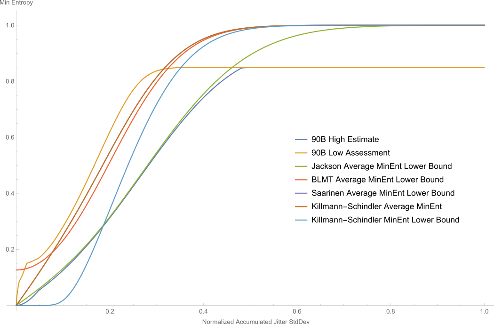
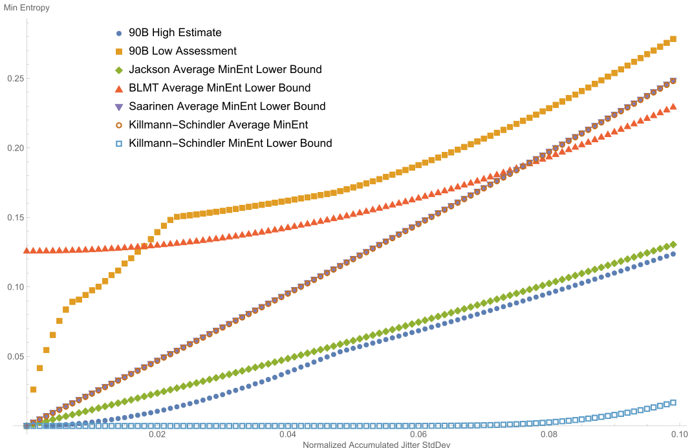

# Theseus: H_submitter Production Utilities

## ro-model
Usage:
	`ro-model [-v] [-J] [-B] [-S] [-K] [-W] [-g <gaussian-prop>] <sigma>` <br />
* Produce a min entropy estimate using the selected stochastic model.
* Input value of type long double (>=0) is provided in `<sigma>`.  Sigma is the observed normalized (period length) jitter standard deviation (expressed as a proportion of the ring oscillator period).
* Output of text summary is sent to stdout.
* Options:
    * `-v`: Verbose mode (can be used up to 3 times for increased verbosity).
    * `-J`: Use the Jackson stochastic model.
    * `-B`: Use the BLMT stochastic model.
    * `-S`: Use the Saarinen stochastic model.
    * `-K`: Use the Killmann-Schindler stochastic model.
    * `-W`: Use the worst-case Killmann-Schindler stochastic model.
    * `-g <gaussian-prop>`: Operate under the assumption that the unpredictable portion of the observed jitter is `<sigma>*<gaussian-prop>` (so reduce the observed jitter by the factor `<gaussian-prop>`).
* Example HPU01 - `<sigma>` is set to 0.111111 and all stochastic models are selected with command `./ro-model -J -B -S -K -W 0.111111`: 
    * Output (to console):
	  ```
	  Min entropy assessment (Ben Jackson's XORed Average): 0.14931310146511437
	  Min entropy assessment (BLMT): 0.25627741169905366
	  Min entropy assessment (Markku-Juhani Saarinen's Lower Bound): 0.28157372645146714
	  Min entropy assessment (Killmann-Schindler Average): 0.28149598259388454
	  Min entropy assessment (Killmann-Schindler Lower Bound): 0.035710520148151201
	  ```
    * Alternate Output (if verbosity 3 (-vvv) is added, to console):
	  ```
	  Provided observed jitter standard deviation 0.111111
	  Truncating Jackson model sum to 5 terms
	  Jackson F = 0
	  Jackson F = 9.817424676261676808053e-07
	  Jackson F = 5.235590191035745045826
	  Jackson tuplePmax = 0.8226931141924319133667
	  Jackson perBitPmax = 0.901679669757153575446
	  Jackson Averaged Per-Bit Min Entropy = 0.1493131014651143681433
	  Min entropy assessment (Ben Jackson's XORed Average): 0.14931310146511437
	  BLMT Model predicts a Shannon Entropy of 0.6408587044045441321856
	  BLMT inferred p_max = 0.83724548049267877
	  Min entropy assessment (BLMT): 0.25627741169905366
	  Truncating Saarinen model sum to 5 terms
	  SaarinenS(b_n=12.72793478929264473186, 1/sqrt(2*sigma^2)=6.36396739464632236593) = 3.181983697323161183398
	  SaarinenS(b_n=6.36396739464632236593, 1/sqrt(2*sigma^2)=6.36396739464632236593) = 3.181983697323161182314
	  SaarinenS(b_n=0, 1/sqrt(2*sigma^2)=6.36396739464632236593) = 2.617795095517872522913
	  Saarinen S_1(1/2; F=0, D=1/2) = 0.2056732785481079783417
	  Saarinen p_e = 0.8226931141924319133667
	  Saarinen Per-Bit Min Entropy Lower Bound = 0.2815737264514671367975
	  Min entropy assessment (Markku-Juhani Saarinen's Lower Bound): 0.28157372645146714
	  KSCycleProb(k=2002, sigma=0.002484517490479791329558) = 1.551558976852110291413e-07
	  KSCycleProb(k=2003, sigma=0.002484517490479791329558) = 0
	  KSCycleProb(k=1997, sigma=0.002484517490479791329558) = 0
	  Final delta: 3
	  KSCycleProb(k=2003, sigma=0.002484517490479791329558) = 0
	  KSCycleProb(k=1997, sigma=0.002484517490479791329558) = 0
	  KSCycleProb(k=2002, sigma=0.002484517490479791329558) = 1.551558976852110291413e-07
	  KSCycleProb(k=1998, sigma=0.002484517490479791329558) = 1.51621048719721138206e-07
	  KSCycleProb(k=2001, sigma=0.002484517490479791329558) = 0.08865344290378404322857
	  KSCycleProb(k=1999, sigma=0.002484517490479791329558) = 0.08860910847561979304009
	  KSCycleProb(k=2000, sigma=0.002484517490479791329558) = 0.8227371363071460442541
	  evenP: 0.822737443084092449192, oddP: 0.1772625513794038362687, extraP: 5.536503714539367689007e-09
	  Min entropy assessment (Killmann-Schindler Average): 0.28149598259388454
	  KSResetCycleProb(x=1000.25, k=2002, mu=0.5, sigma=0.002484517490479791329558) = 7.565701759010992813507e-12
	  KSResetCycleProb(x=1000.25, k=2003, mu=0.5, sigma=0.002484517490479791329558) = 1.273858505963860365076e-29
	  KSResetCycleProb(x=1000.25, k=1997, mu=0.5, sigma=0.002484517490479791329558) = 0
	  Final delta: 3
	  KSResetCycleProb(x=1000.25, k=2003, mu=0.5, sigma=0.002484517490479791329558) = 1.273858505963860365076e-29
	  KSResetCycleProb(x=1000.25, k=1997, mu=0.5, sigma=0.002484517490479791329558) = 0
	  KSResetCycleProb(x=1000.25, k=2002, mu=0.5, sigma=0.002484517490479791329558) = 7.565701759010992813507e-12
	  KSResetCycleProb(x=1000.25, k=1998, mu=0.5, sigma=0.002484517490479791329558) = 7.221785344214970425725e-12
	  KSResetCycleProb(x=1000.25, k=2001, mu=0.5, sigma=0.002484517490479791329558) = 0.01224225931610112731122
	  KSResetCycleProb(x=1000.25, k=1999, mu=0.5, sigma=0.002484517490479791329558) = 0.01220655235673605873252
	  KSResetCycleProb(x=1000.25, k=2000, mu=0.5, sigma=0.002484517490479791329558) = 0.9755511975181251480742
	  evenP: 0.9755511975329126351728, oddP: 0.02444881167283718604289, extraP: -9.205749821215646966702e-09
	  Min entropy assessment (Killmann-Schindler Lower Bound): 0.035710520148151201
	  ```

Some example results are contained within the following graphs: <br />




Note that the Killmann-Schindler stochastic model and the Saarinen stochastic model produce effectively equivalent results.

## linear-interpolate
Usage:
	`linear-interpolate [-v] [-i] [-x] <value>`
* Takes a set of points (`x_1`, `y_1`), ... (`x_n`, `y_n`) and treats the points as a relation.  The relation is then forced to be functional by discarding point; by default, the point with the lowest value (y-value) is retained for each distinct argument (x-value), unless otherwise directed.  The points in the resulting function are then used to define and extension function f: `[x_1, x_n] -> R`, where the values are established through linear interpolation.  The reference data may include the arguments (x-values) INFINITY (or INF) and -INFINITY (or -INF) as end arguments (`x_1` or `x_n`). These are a flag that the function should be extended as a constant function.  The value of such points must be equal to the nearest argument (x-value).  This tool can be used to infer parameters from the statistical results.
* Input values are a set of points in decimal format and are provided via stdin, one per line.  The set of points (`x_1`, `y_1`), ... (`x_n`, `y_n`) are treated as a relation.
* Output of text summary is sent to stdout.
* Options:
    * `<value>`: Required. Provided argument as a double.
	* `-v`: Verbose mode (can be used up to 3 times for increased verbosity).
	* `-i`: After the described relation is turned into a function, the relation's coordinates are exchanged, and points are discarded from the resulting relation until it is again a function (this is in some sense an inverse function).
	* `-x`: If we encounter a relation with multiple equal arguments, keep the one with the largest value (y-value).
	* `-c`: Assume that the function (or its inverse) is constant when out of the domain (or range, respectively).
* Example HPU02 - A text file is sent to stdin, verbosity 2 is set, and `<value>` is set to 0.111111 with command `./linear-interpolate -vv 0.111111 < hpu02-input.txt`: 
    * Input (in hpu02-input.txt, viewed in a text editor):
	  ```
	  0.0, 0.0
	  0.010000007399197262,0.097507479880620529
	  0.020000014798394524,0.13931019590278582
	  0.030000022197591791,0.15463122944266899
	  0.040000029596789048,0.16202776346734171
	  0.050000036995986319,0.17151353943342887
	  0.060000044395183583,0.18751052556718961
	  0.070000051794380833,0.20658938499691396
	  0.080000059193578096,0.22852197721055623
	  0.09000006659277536,0.25382356204949263
	  0.10000007399197264,0.28106592079303278
	  0.1100000813911699,0.30987423659567748
	  0.12000008879036717,0.34030862469565337
	  0.1300000961895644,0.37224420006914999
	  0.14000010358876167,0.40566061267991393
	  0.15000011098795893,0.44015948707913793
	  0.16000011838715619,0.47563046057714325
	  0.17000012578635348,0.51173183601398409
	  0.18000013318555072,0.54800746544817724
	  0.19000014058474798,0.58412213577372629
	  0.20000014798394528,0.61982885293353562
	  0.21000015538314251,0.65397675949125578
	  0.2200001627823398,0.68684282381127126
	  0.23000017018153704,0.71729234714854395
	  0.24000017758073433,0.7447852090794298
	  0.25000018497993159,0.76901445368437227
	  0.2600001923791288,0.78988924236601388
	  0.27000019977832612,0.80676481650229426
	  0.28000020717752333,0.81968394103212716
	  0.29000021457672065,0.82956412972112203
	  0.30050022234587775,0.8369629439616838
	  0.31050022974507502,0.84160214308407733
	  0.32050023714427228,0.84489377742745797
	  0.3335002467632287,0.84721274265511493
	  0.34150025268258649,0.84800016591045169
	  0.35000025897190418,0.84873552601543445
	  0.36000026637110144,0.84907465091678369
	  0.37000027377029876,0.84934557928626186
	  ```
    * Output (to console):
	  ```
	  Looking for an approximate value for the argument 0.111111
	  Number of input points: 38
	  Number of non-duplicated points: 38
	  Number of points after constant interval merging: 38
	  interpolate between (0.1100000813911699, 0.30987423659567748) and (0.12000008879036717, 0.34030862469565337).
	  0.31325524690286333
	  ```
    * Alternate Output (if -i is added, to console):
	  ```
	  Looking for argument that yields a value of approximately 0.111111
	  Number of input points: 38
	  Number of non-duplicated points: 38
	  Number of points after constant interval merging: 38
	  Checking to see if the described function is monotonic up: Yes.
	  Number of non-duplicated inverse points: 38
	  interpolate between (0.097507479880620529, 0.010000007399197262) and (0.13931019590278582, 0.020000014798394524).
	  0.013254229009505855
	  ```